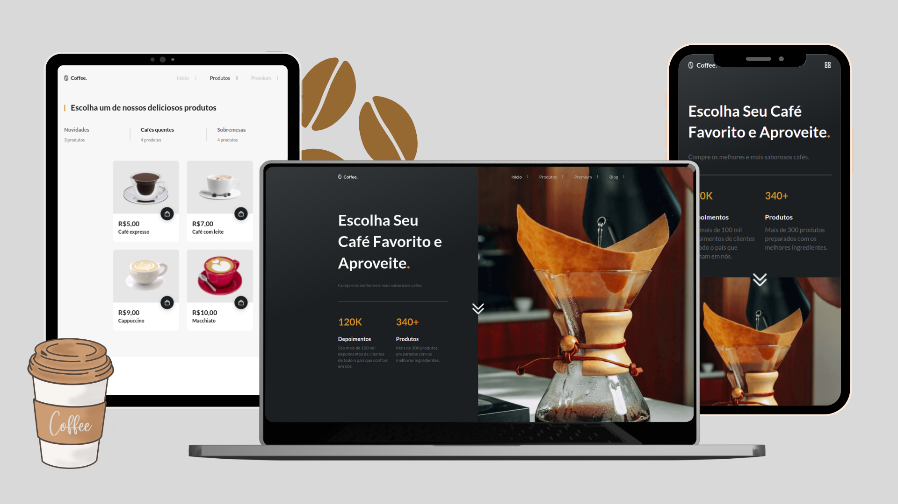

<h1 align="center">Coffee Shop</h1>

<p align="center">✔️ Concluded</p>

<div align="center">
  
  
  
</div>

## 💻 Instalando o projeto

Clone o repositório:

```
git clone git@github.com:lramos33/coffee-shop.git
```

Acesse a pasta do repositório

```
cd coffee-shop
```

Instale as dependências:
```
npm install
```

Execute a aplicação
```
npm run dev
```

## 🚀 Demonstração



[Live demo](https://lramos33-coffee-shop.herokuapp.com/)

---

Made with ♥ by Leonardo Ramos 👋 [Get in touch!](https://www.linkedin.com/in/lramos33/)
